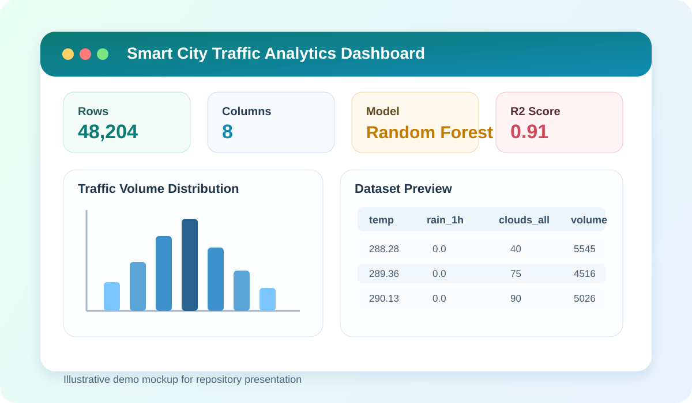
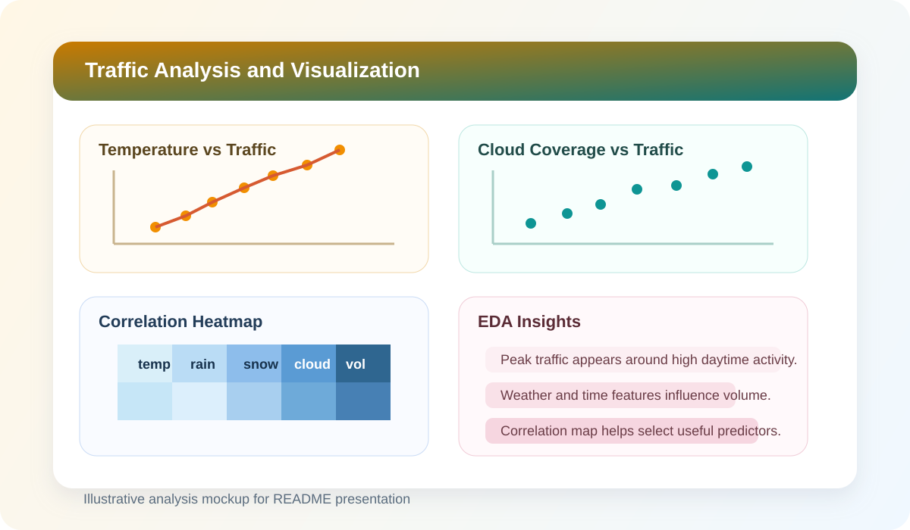
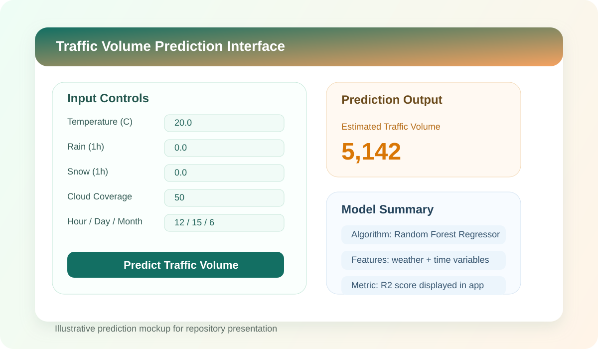
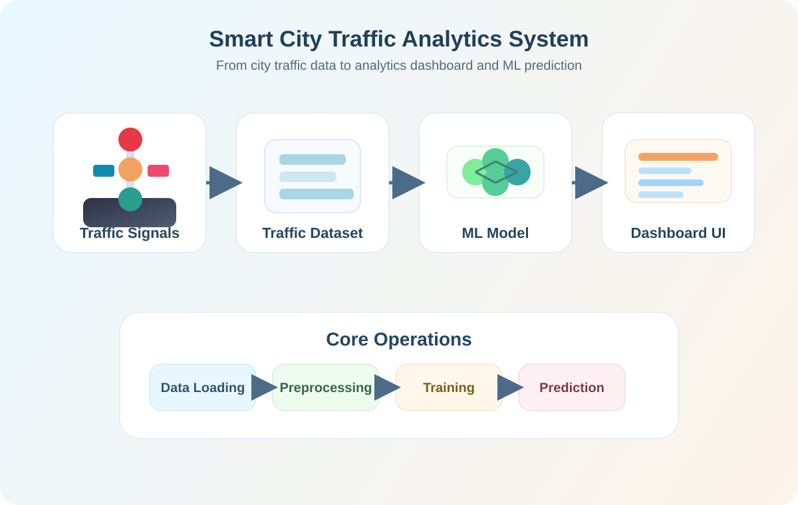
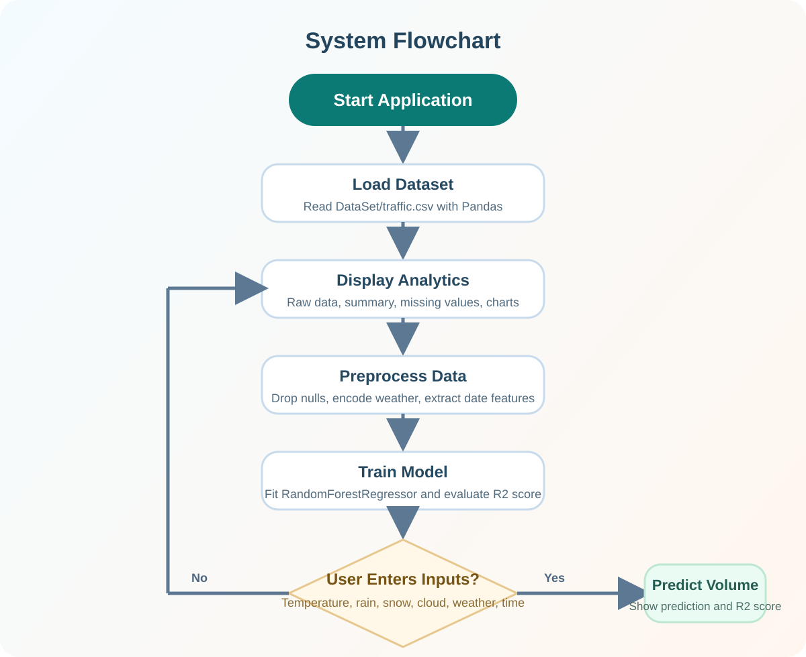

# Smart City Traffic Analytics System

This project is a Streamlit-based traffic analytics dashboard that explores historical traffic data, visualizes key patterns, preprocesses features, trains a machine learning model, and predicts traffic volume from user input.

## Demo Images

### 1. Dashboard Preview


### 2. Data Analysis Preview


### 3. Prediction Preview


## Pictorial Overview



## Flowchart



## Features

- Load and inspect traffic dataset
- View raw data, dataset size, and column details
- Check data types and missing values
- Explore statistical summary
- Visualize traffic patterns with charts
- Preprocess categorical and datetime features
- Train a `RandomForestRegressor` model
- Predict traffic volume from custom inputs
- Display model performance with R2 score

## Tech Stack

- Python
- Streamlit
- Pandas
- Matplotlib
- Seaborn
- Scikit-learn

## Dataset Columns

The dataset used in this project contains the following columns:

- `temp`
- `rain_1h`
- `snow_1h`
- `clouds_all`
- `weather_main`
- `weather_description`
- `date_time`
- `traffic_volume`

## Project Structure

```text
Traffic-Control-System/
|-- app.py
|-- requirements.txt
|-- README.md
|-- assets/
|   |-- demo-dashboard.svg
|   |-- demo-analysis.svg
|   |-- demo-prediction.svg
|   |-- pictorial-overview.svg
|   |-- system-flowchart.svg
`-- DataSet/
    |-- traffic.csv
    `-- temp
```

## How It Works

1. The app loads `DataSet/traffic.csv`.
2. Users can inspect data, summaries, and charts in the dashboard.
3. Missing values are removed during preprocessing.
4. Categorical weather columns are label encoded.
5. The `date_time` column is converted into hour, day, and month features.
6. A Random Forest regression model is trained on the processed dataset.
7. Users enter weather and time-based inputs to predict traffic volume.

## Installation

```bash
pip install -r requirements.txt
```

## Run the App

```bash
streamlit run app.py
```

## Expected Output

After launching the app, you can:

- inspect the traffic dataset
- view charts and correlation heatmap
- train the traffic prediction model
- enter custom values and predict traffic volume

## Notes

- The SVG demo images in this README are illustrative project visuals for presentation.
- The model used in the current version is `RandomForestRegressor`.
- The dataset is read from `DataSet/traffic.csv`.

## Author

Developed as a Smart City Traffic Analytics and Prediction project using Streamlit and machine learning.
